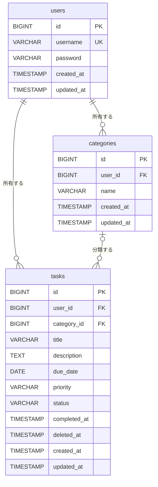

# テーブル設計

## ER図



## テーブル定義

型はPostgreSQLを基準にしている。

### users（ユーザー）

| カラム | 型 | NULL | 初期値 | 説明 |
| --- | --- | --- | --- | --- |
| id | BIGSERIAL | × | 自動採番 | 主キー |
| username | VARCHAR(50) | × | | ログインに使う名前。一意 |
| password | VARCHAR(255) | × | | BCryptでハッシュ化した値 |
| created_at | TIMESTAMP | × | 現在日時 | 登録日時 |
| updated_at | TIMESTAMP | × | 現在日時 | 更新日時 |

### categories（カテゴリ）

| カラム | 型 | NULL | 初期値 | 説明 |
| --- | --- | --- | --- | --- |
| id | BIGSERIAL | × | 自動採番 | 主キー |
| user_id | BIGINT | × | | users.id への外部キー |
| name | VARCHAR(50) | × | | カテゴリ名 |
| created_at | TIMESTAMP | × | 現在日時 | 登録日時 |
| updated_at | TIMESTAMP | × | 現在日時 | 更新日時 |

一意制約として (user_id, name) を設定する。ユーザーが違えば同じ名前を使える。

### tasks（タスク）

| カラム | 型 | NULL | 初期値 | 説明 |
| --- | --- | --- | --- | --- |
| id | BIGSERIAL | × | 自動採番 | 主キー |
| user_id | BIGINT | × | | users.id への外部キー |
| category_id | BIGINT | ○ | | categories.id への外部キー。NULLは未分類 |
| title | VARCHAR(100) | × | | タイトル |
| description | TEXT | ○ | | 詳細（1000文字以内はアプリ側でチェック） |
| due_date | DATE | ○ | | 期限 |
| priority | VARCHAR(10) | × | 'MEDIUM' | HIGH / MEDIUM / LOW |
| status | VARCHAR(20) | × | 'TODO' | TODO / IN_PROGRESS / DONE |
| completed_at | TIMESTAMP | ○ | | 完了日時。statusがDONEのときだけ値が入る |
| deleted_at | TIMESTAMP | ○ | | 削除日時。NULLなら有効、値があれば削除済み |
| created_at | TIMESTAMP | × | 現在日時 | 登録日時 |
| updated_at | TIMESTAMP | × | 現在日時 | 更新日時 |

## 設計メモ

### 論理削除は tasks だけに適用する

論理削除するのはタスクだけにする。カテゴリは物理削除にして、実装をシンプルに保つ。

削除済みかどうかは `deleted_at` で判定する。フラグ（true/false）にしなかったのは、いつ削除したかも残せるから。

タスクを取得するSQLには、すべて `deleted_at IS NULL` の条件を付ける必要がある。付け忘れると削除したタスクが画面に出てしまう。Hibernateの `@SQLRestriction("deleted_at IS NULL")` をEntityに付ければ、この条件を自動で追加できる。

### 削除時の外部キーの動き

| 削除するもの | 関連データの扱い | 外部キーの設定 |
| --- | --- | --- |
| カテゴリ | tasks.category_id をNULLにする | `ON DELETE SET NULL` |

### 優先度とステータスは文字列で保存する

Javaでは `enum` で定義し、JPAの `@Enumerated(EnumType.STRING)` で文字列として保存する。初期設定の `ORDINAL`（0, 1, 2の番号）だと、あとでenumの並び順を変えたときにデータの意味がずれてしまう。

### 他ユーザーのデータを見せない

tasksとcategoriesは、どちらもuser_idを持つ。データを取得するときは、必ずログイン中のユーザーのIDで絞り込む。

```java
// NG: IDだけで探すと、他人のタスクも取得できてしまう
taskRepository.findById(id);

// OK: ログイン中のユーザーのタスクだけを探す
taskRepository.findByIdAndUserId(id, loginUserId);
```

見つからない場合は404を返す。403にしないのは、他人のタスクが存在すること自体を知られないようにするため。

### インデックス

| テーブル | カラム | 目的 |
| --- | --- | --- |
| tasks | (user_id, deleted_at) | 一覧表示で毎回使う条件 |
| tasks | category_id | カテゴリでの絞り込み |
