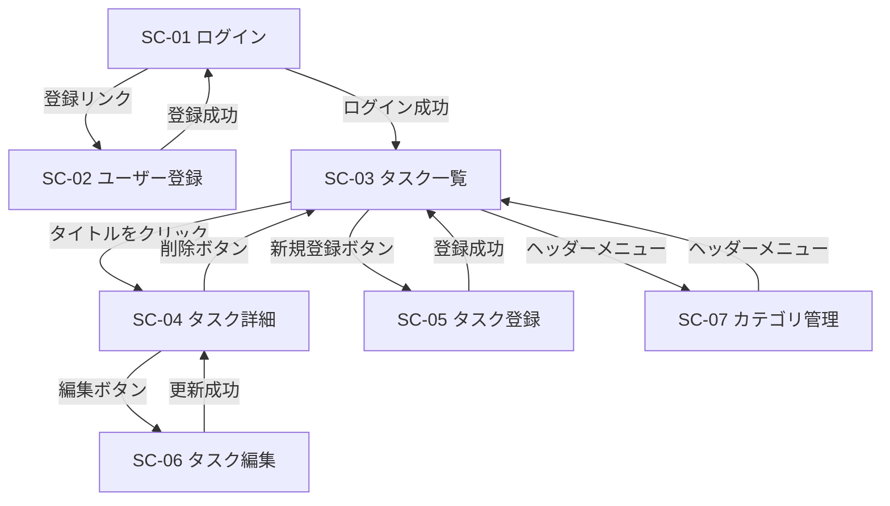

# 画面設計

## 画面一覧

| ID | 画面名 | URL | ログイン | 主な機能 |
| --- | --- | --- | --- | --- |
| SC-01 | ログイン | `GET /login` | 不要 | F-02 |
| SC-02 | ユーザー登録 | `GET /signup` | 不要 | F-01 |
| SC-03 | タスク一覧 | `GET /tasks` | 必要 | F-03, F-08, F-10, F-11 |
| SC-04 | タスク詳細 | `GET /tasks/{id}` | 必要 | F-04, F-07, F-08 |
| SC-05 | タスク登録 | `GET /tasks/new` | 必要 | F-05 |
| SC-06 | タスク編集 | `GET /tasks/{id}/edit` | 必要 | F-06 |
| SC-07 | カテゴリ管理 | `GET /categories` | 必要 | F-09 |
| SC-08 | エラー | なし | なし | 404・500など |

ログイン後のトップは `/tasks` にする。`/` にアクセスした場合も `/tasks` へリダイレクトする。

## 画面遷移図

ログイン後の全画面に共通ヘッダーを置く。ヘッダーには「タスク一覧」「カテゴリ管理」「ログアウト」へのリンクを並べる。

## 操作とURLの対応

画面表示以外の操作は、フォームのPOSTで受け付ける。処理が終わったら別の画面へリダイレクトし、ブラウザの再読み込みで二重送信が起きないようにする（PRGパターン）。

| 操作 | メソッドとURL | 成功時の移動先 |
| --- | --- | --- |
| ユーザー登録 | `POST /signup` | `/login` |
| ログイン | `POST /login` | `/tasks` |
| ログアウト | `POST /logout` | `/login` |
| タスク登録 | `POST /tasks` | `/tasks` |
| タスク更新 | `POST /tasks/{id}` | `/tasks/{id}` |
| タスク削除 | `POST /tasks/{id}/delete` | `/tasks` |
| ステータス変更 | `POST /tasks/{id}/status` | 元の画面 |
| カテゴリ登録 | `POST /categories` | `/categories` |
| カテゴリ名変更 | `POST /categories/{id}` | `/categories` |
| カテゴリ削除 | `POST /categories/{id}/delete` | `/categories` |

削除の前には、JavaScriptの確認ダイアログを表示する。

## 各画面の内容

### SC-01 ログイン

- 入力項目はユーザー名とパスワード
- 認証に失敗したら「ユーザー名またはパスワードが違います」と表示する
- ユーザー登録画面へのリンクを置く

### SC-02 ユーザー登録

- 入力項目はユーザー名、パスワード、パスワード（確認）
- ユーザー名は3〜50文字の半角英数字とし、登録済みの名前は使えない
- パスワードは8文字以上とし、確認用と一致しない場合はエラーにする

### SC-03 タスク一覧

- 表示する列は、タイトル、ステータス、優先度、期限、カテゴリ
- 期限切れで未完了のタスクは行を赤く表示する
- 画面上部に検索フォームを置く（キーワード、ステータス、カテゴリ、期限の範囲）
- 列見出しをクリックすると並び替える
- 1ページ10件で表示し、ページ送りを置く

### SC-04 タスク詳細

- タスクの全項目と、登録日時・更新日時を表示する
- 「編集」「削除」ボタンと、ステータス変更のボタンを置く

### SC-05 タスク登録 / SC-06 タスク編集

- 2つの画面は同じThymeleafテンプレートを使い回す
- カテゴリはセレクトボックスで選ぶ
- 入力エラーのときは、入力内容を残したままエラーメッセージを項目の下に表示する

### SC-07 カテゴリ管理

- 1画面に一覧と登録フォームを並べる
- 一覧の各行で名前の変更と削除ができる
- 名前は1〜50文字とし、同じ名前は登録できない
